# Mix It Up

A recipe sharing web app for cocktails and food. Save your own mixes, share them with friends, and let the shuffle pick a pairing when you cannot decide what to make.

## Team Members

| UWA ID | Name | GitHub |
| --- | --- | --- |
| 21211711 | Asad Maza | [@mangomaza](https://github.com/mangomaza) |
| 24923772 | Jianing Chen | [@Ricky101087](https://github.com/Ricky101087) |
| 24563207 | Wendy Song | [@WendySong1](https://github.com/WendySong1) |
| 24489475 | Wenmin Luo | [@onikirinana](https://github.com/onikirinana) |

## Table of Contents

- [Mix It Up](#mix-it-up)
  - [Team Members](#team-members)
  - [Table of Contents](#table-of-contents)
  - [Description](#description)
  - [Features](#features)
  - [Design and Development](#design-and-development)
  - [Technology Stack](#technology-stack)
  - [Setup](#setup)
  - [Running the Tests](#running-the-tests)
  - [User Stories](#user-stories)
  - [Pages and Views](#pages-and-views)
  - [Architecture](#architecture)
  - [Database Design](#database-design)
  - [Security](#security)
  - [Project Structure](#project-structure)
  - [Database Seeding and User Accounts](#database-seeding-and-user-accounts)
  - [Database Migrations](#database-migrations)
  - [Screenshots](#screenshots)
  - [Contribution](#contribution)
  - [External Data Sources and Attribution](#external-data-sources-and-attribution)

## Description

Mix It Up is a Flask web app built for the CITS5505 Agile Web Development group project. The site lets registered users build up their own recipe collection, mark recipes as public or private, share private recipes with specific friends, rate other people's recipes, and pull a random cocktail and food pairing from external recipe APIs when they want some inspiration. The look and feel borrows from old mixtape covers, so cocktails sit on "Side A" and food sits on "Side B".

## Features

**Account Management:** Sign up, login, logout, and a profile page where users can change their username, email, password, and upload an avatar.

**Recipe Management:** Logged in users can create recipes with a name, description, category (Cocktail or Food), an optional subcategory and glass, ingredients with measures, instructions, and an image upload. Owners can edit or delete their own recipes from the recipe detail page.

**Public and Community Sharing:** A recipe can be saved as public so anyone visiting the site can see it on the Recipes page, or saved as private so only the owner can see it by default.

**Private Sharing:** Owners of a private recipe can grant view access to specific other users from the Share page, and revoke that access at any time.

**Ratings:** Logged in users can give any recipe they are allowed to view a one to five star rating, and the average rating is shown on the recipe detail page and the recipes listing.

**Random Draw:** The hero on the home page has a "Mix It Up" shuffle that opens a modal with two cassette cards, one cocktail and one food, pulled live from TheCocktailDB and TheMealDB. From there a logged in user can save the pick into their own collection, either as is or with edits.

**My Recipes View:** The Recipes page has a "My Recipes" tab so users can quickly find everything they have created, including their private ones.

**Search and Filters:** The Recipes page supports filtering by category and subcategory and a text search so visitors can narrow the list down quickly.

## Design and Development

The visual design started as a Figma mockup of the home page and got carried through the rest of the site.

Figma: https://www.figma.com/design/3DmFoQ9vhlhqULkTrv2ypY/Mix-It-Up---Index-page?node-id=1-219

The team used GitHub issues to develop, each issue was used to create a feature branch to a pull request reviewed by another team member before merging into main. Issue numbers are referenced in commits and PR descriptions, and the agreed git workflow is documented in [docs/git-contribution-guide.md](docs/git-contribution-guide.md).

## Technology Stack

**Backend:**

- **Python 3.12** language
- **Flask 3** web framework
- **Flask-Login** for session based authentication
- **Flask-SQLAlchemy** and **SQLAlchemy 2** ORM for the data layer
- **Flask-Migrate (Alembic)** for schema migrations
- **Flask-WTF** and **WTForms** for form rendering, validation, and CSRF protection
- **Werkzeug** for password hashing
- **python-dotenv** for environment configuration
- **requests** for talking to TheCocktailDB and TheMealDB

**Frontend:**

- **Jinja2** templates
- **Bootstrap 5** for layout and components
- **HTML5** form validation
- **JavaScript** for live interactions like the random draw modal

**Database:**

- **SQLite** via SQLAlchemy ORM, stored at `instance/mixitup.db`

**Testing:**

- Python **unittest**
- **Selenium 4** with WebDriver Manager for browser based system tests

## Setup

1. Clone the repo and change into the project folder.

   ```
   git clone https://github.com/mangomaza/CITS5505-Group-Project.git
   cd CITS5505-Group-Project
   ```

2. Create and activate a virtual environment.

   macOS/Linux:
   ```
   python3 -m venv .venv #Windows python -m venv .venv
   source .venv/bin/activate #Windows .venv\Scripts\activate
   ```

3. Install dependencies.

   ```
   pip install -r requirements.txt
   ```

4. Create the `.env` file.

   The app needs a `SECRET_KEY` for session signing and CSRF protection. Run the helper and it'll prompt you for the string and write `.env` for you (it's already gitignored):

   ```
   python3 setup_env.py #Windows python setup_env.py
   ```

   When prompted, paste in any long random string. Example of what to enter:

   ```
   3f8a9c2e1b4d6f7a8c9e0b1d2f3a4c5e6b7d8f9a0c1e2b3d4f5a6c7e8b9d0f1a
   ```

   Exact value doesn't matter. The app reads `.env` automatically on startup.

5. Create the database.

   ```
   flask --app app.py db upgrade
   ```

   This creates `instance/mixitup.db` with the latest schema.

6. (Optional) Load sample data.

   ```
   python3 seed_db.py #Windows python seed_db.py
   ```

   This wipes the database and inserts four test users with sample recipes, ratings, and shares. Skip if you want to start empty.

7. Run the app.

   ```
   python3 app.py #Windows python app.py
   ```

   Open http://127.0.0.1:5000 in your browser.

   By default the app uses the development config. To change it, set `FLASK_CONFIG` before running (`development`, `testing`, or `production`).

## Running the Tests

Created 10 unit tests and 10 Selenium system tests. The Selenium tests start the Flask app themselves and drive it through Chrome using WebDriver Manager, so Chrome needs to be installed on the machine. A valid `.env` with `SECRET_KEY` must be present **(Step 4 of [Setup](#setup))**.

Run everything at once:

```bash
python3 -m unittest tests.test_suite #Windows python -m unittest tests.test_suite
```

Run just the unit tests or just the Selenium tests:

```bash
python3 -m unittest tests.test_issue_unit #Windows python -m unittest tests.test_issue_unit
python3 -m unittest tests.test_selenium_system #Windows python -m unittest tests.test_selenium_system
```

## User Stories

Authentication and accounts

- As a visitor I want to sign up with a username, email, and password so I can save my own recipes.
- As a returning user I want to log in and log out so my account stays private.
- As a logged in user I want to update my profile details and avatar so my account reflects who I am.

Recipe management

- As a logged in user I want to add a new recipe with ingredients, instructions, and an image so I can keep my recipes in one place.
- As an owner I want to edit or delete one of my recipes so I can fix mistakes or remove old entries.
- As a logged in user I want a "My Recipes" view so I can quickly find everything I have created.

Sharing and visibility

- As an owner I want to mark a recipe as public so the whole community can see it.
- As an owner I want to keep a recipe private by default so only I can see it.
- As an owner I want to share a private recipe with a specific user so they can view it without it going public.
- As an owner I want to revoke a private share at any time.

Discovery and rating

- As a visitor I want to browse all public recipes and filter them by category or search by text.
- As a logged in user I want to give a recipe a rating from one to five stars so other users can see what is popular.
- As a visitor I want to use the random draw to get a surprise cocktail and food pairing when I am not sure what to make.
- As a logged in user I want to save a random draw result into my own collection so I can come back to it.

## Pages and Views

| Route | Purpose |
| --- | --- |
| `/` | Home page with hero, random draw trigger, recent recipes, and top rated recipes |
| `/recipes` | Browse all public recipes plus a "My Recipes" tab for the logged in user |
| `/recipes/<id>` | Recipe detail page with ingredients, instructions, ratings, and owner controls |
| `/recipe/create` | Form to create a new recipe |
| `/recipes/<id>/edit` | Owner only edit form |
| `/recipes/<id>/delete` | Owner only delete action (POST) |
| `/recipes/<id>/rate` | Submit a rating for a recipe (POST) |
| `/recipes/random.json` | JSON endpoint that returns a paired cocktail and food draw |
| `/recipes/save-external` | Save a random draw result into the logged in user's collection |
| `/share` | Manage private shares: grant or revoke access to other users |
| `/profile` | View and edit the logged in user's profile and avatar |
| `/auth/signup` | Account creation |
| `/auth/login` | Sign in |
| `/auth/logout` | Sign out (POST) |

## Architecture

The app uses the application factory pattern. `create_app()` in [app/__init__.py](app/__init__.py) builds a Flask instance, loads config from [config.py](config.py), wires up SQLAlchemy, Flask-Login, Flask-Migrate, and CSRF, and registers three blueprints:

- `auth` for signup, login, and logout, defined in [app/routes/auth_routes.py](app/routes/auth_routes.py).
- `main` for everything else, defined in [app/routes/main_routes.py](app/routes/main_routes.py).
- `errors` for custom 404 and 500 pages.

Forms live under [app/forms/](app/forms/) and are split by feature (auth, recipes, share). Database models live under [app/models/](app/models/). Templates live under [app/templates/](app/templates/) and extend a shared `base.html`.

## Database Design

The rationale for each table and field is in the database planning thread:

The full schema rationale, field-by-field notes, and migration history are documented in [Issue #39](https://github.com/mangomaza/CITS5505-Group-Project/issues/39). Supporting discussion covers the API-driven field choices for `Recipe`, `Ingredient`, and `Rating` in [Issue #42](https://github.com/mangomaza/CITS5505-Group-Project/issues/42), and the `SharedAccess` model and visibility helper in [Issue #44](https://github.com/mangomaza/CITS5505-Group-Project/issues/44).

The diagram below reflects the schema in `app/models/`.

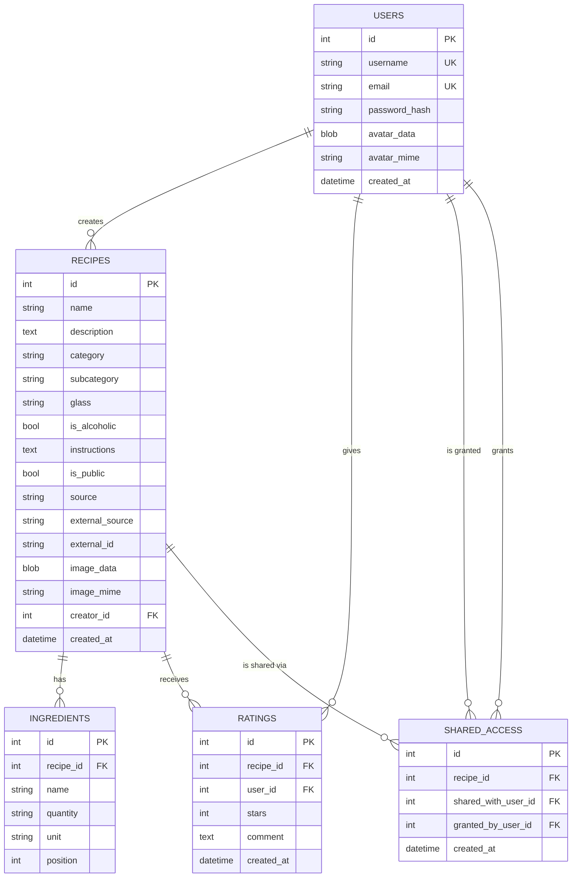

## Security

Mix It Up validates user input on three layers and uses the ORM for every database call.

- Passwords are hashed with `werkzeug.security.generate_password_hash` and never stored in plain text.
- All forms use Flask-WTF, which adds CSRF tokens to every POST and rejects requests with a missing or invalid token.
- Server side validators check required fields, lengths, email format, and password rules, and custom validators check uniqueness for username and email.
- HTML5 attributes (`required`, `minlength`, `maxlength`, `type="email"`, `pattern`) give the user instant feedback in the browser, but the server is always the source of truth.
- Jinja autoescapes template variables by default, so user supplied content cannot inject HTML or script tags.
- Ownership and visibility checks (`can_view_recipe`, owner checks in edit and delete routes) stop users from accessing or modifying recipes they do not own.
- All database access goes through SQLAlchemy ORM, so queries are parameterised and immune to SQL injection.
- The Flask `SECRET_KEY` is read from a `.env` file and never committed.

## Project Structure

```
CITS5505-Group-Project/
├── app.py                     # Entry point, runs the Flask dev server
├── config.py                  # Configuration loaded by create_app
├── seed_db.py                 # Demo data loader
├── requirements.txt
├── app/
│   ├── __init__.py            # Application factory, extension setup, blueprint registration
│   ├── forms/                 # Flask-WTF forms (auth, recipes, share)
│   ├── models/                # SQLAlchemy models (User, Recipe, Ingredient, Rating, SharedAccess)
│   ├── routes/                # Blueprint route handlers (auth, main, errors)
│   ├── static/                # CSS, JavaScript, and bundled images
│   ├── templates/             # Jinja2 templates extending base.html
│   └── utils/                 # Small helpers (image handling, etc.)
├── migrations/                # Flask-Migrate / Alembic versioned migrations
├── instance/                  # Runtime data (mixitup.db SQLite file, not in version control)
├── tests/                     # Unit tests and Selenium system tests
├── docs/                      # Contribution guide and screenshots
└── README.md
```

## Database Seeding and User Accounts

The `seed_db.py` script wipes and reloads the database with four demo users, twelve recipes (a mix of cocktails and food, some public and some private), a set of ratings, and one or two private shares between users. It is handy for the marker to log in and exercise the app without having to create accounts first.

```bash
python3 seed_db.py
```

Demo accounts created by the seed script:

| Username | Email | Password |
| --- | --- | --- |
| mangomaza | asad@test.com | Asadpass123 |
| jianing | jianing@test.com | Jianingpass123 |
| wendy | wendy@test.com | Wendypass123 |
| wenmin | wenmin@test.com | Wenminpass123 |

These credentials are for local development only. Change `SECRET_KEY` and the demo passwords before running the app anywhere public.

## Database Migrations

The project uses Flask-Migrate (Alembic) for schema changes. There are 6 migrations in `migrations/versions/` to date, covering the users table, the recipes / ingredients / ratings tables, the shared access table, the image blob swap on recipes, dropping the cuisine column, and the avatar columns on users.

Common commands:

```bash
flask db upgrade           # apply all migrations
flask db downgrade         # roll back the most recent migration
flask db migrate -m "msg"  # generate a new migration from model changes
flask db history           # list the migration chain
flask db current           # show the current revision
```

## Screenshots

**Home page (logged out):**

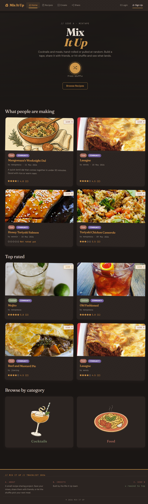

**Recipes browse page:**

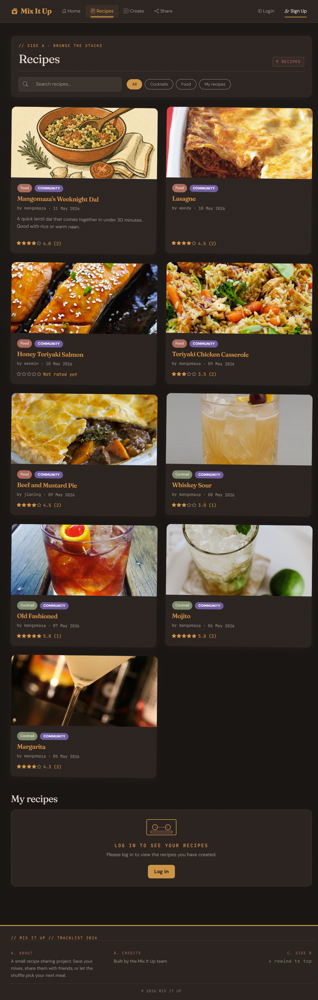

**Recipe detail page:**

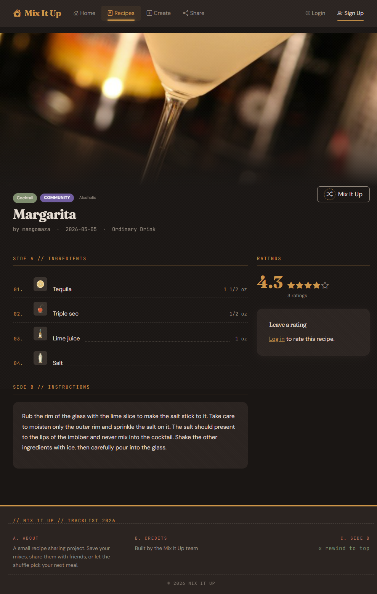

**Sign up:**

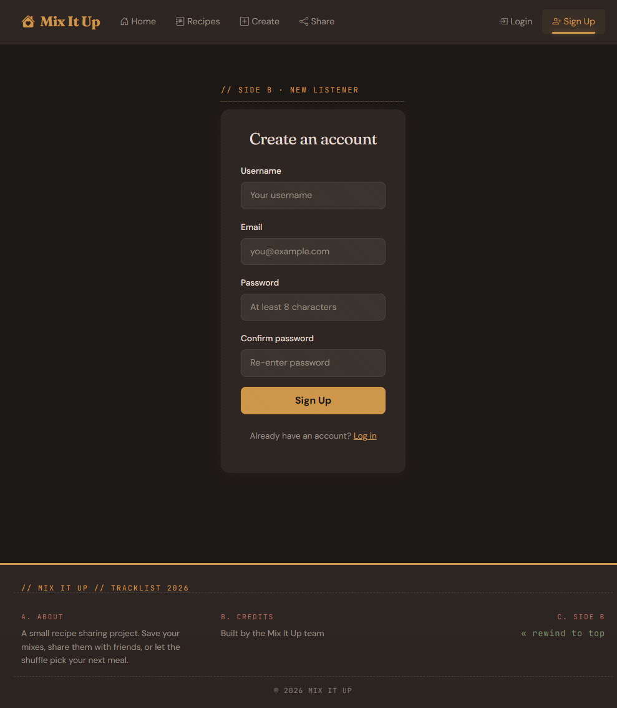

**Login:**

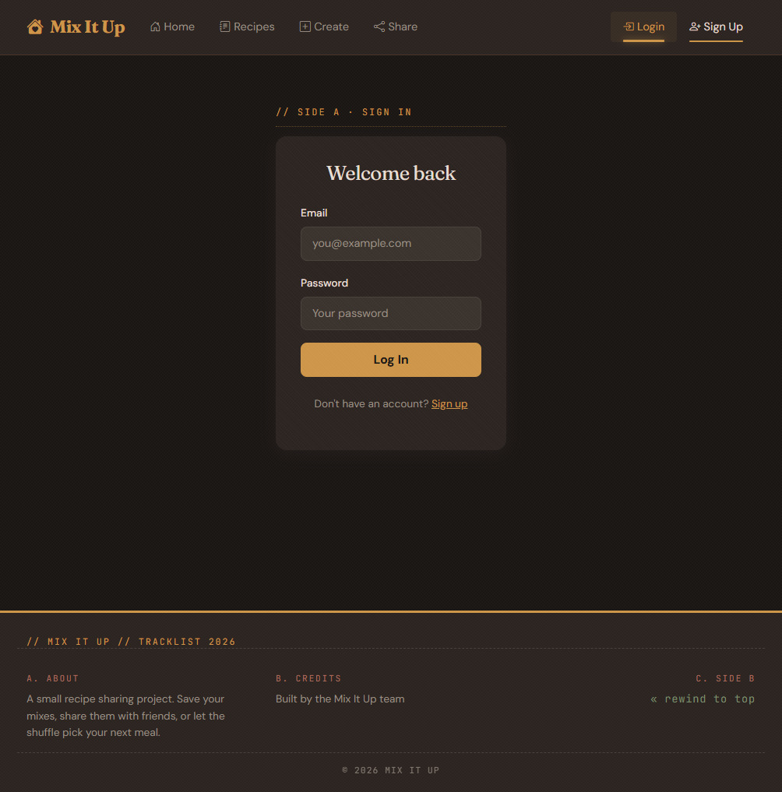

**Home page (logged in):**

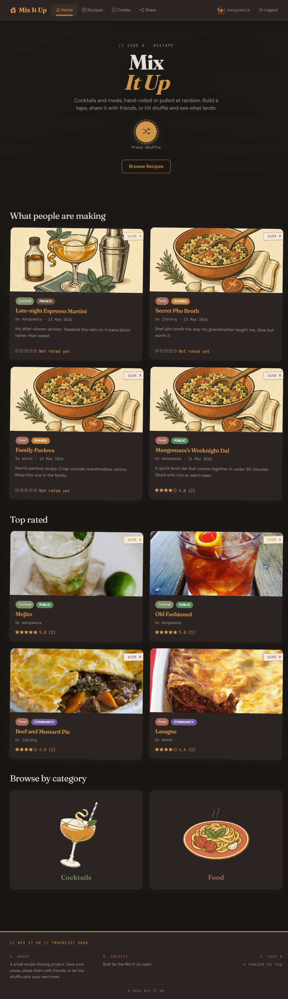

**Create a recipe:**

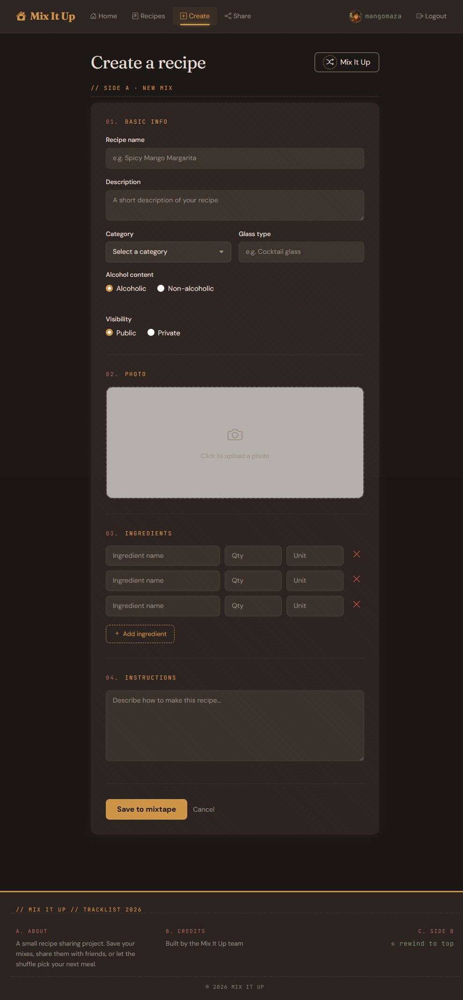

**Share manager:**

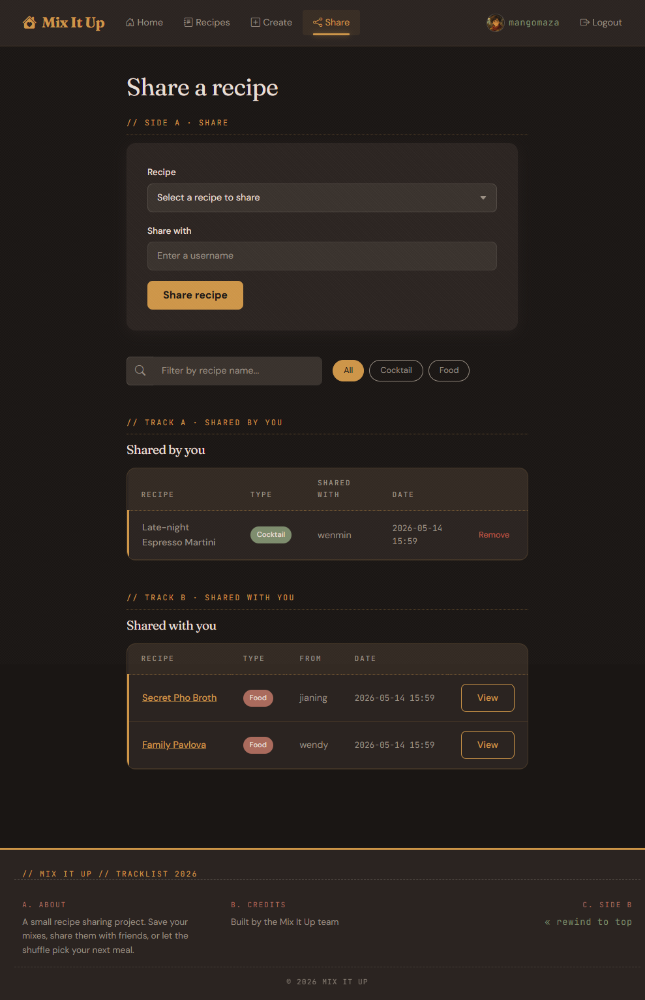

**Profile:**

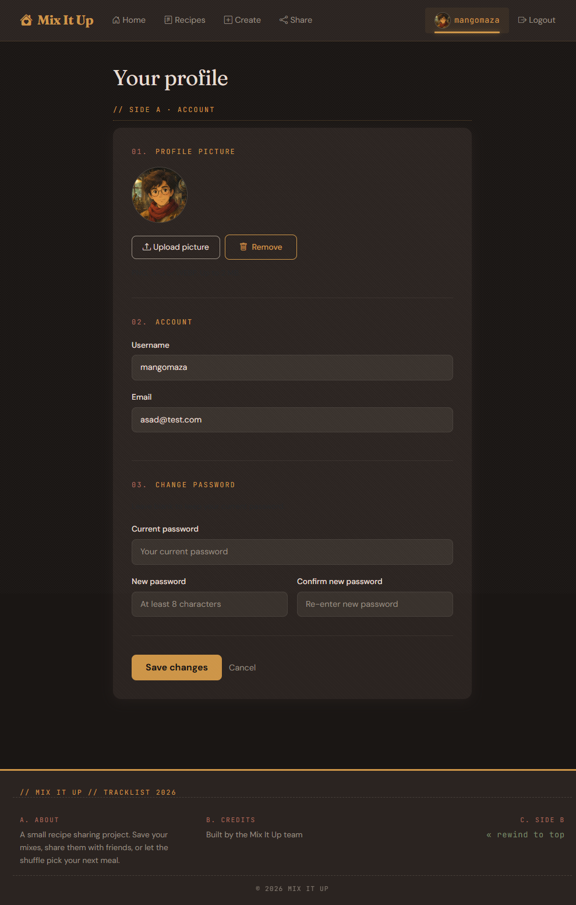

**Random draw modal:**

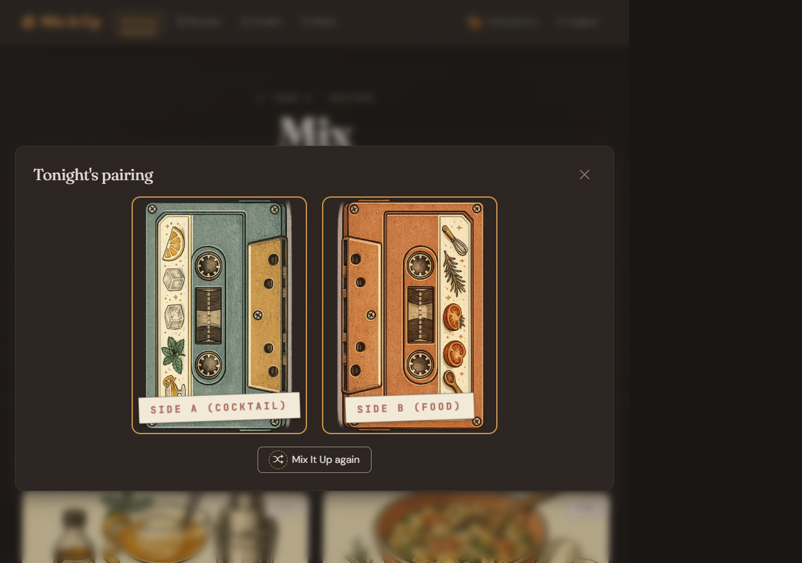

## Contribution

We worked in feature branches off `main`, one branch per GitHub issue, with every change going through a pull request and a review from another team member before merging. The full workflow, including branch naming, commit style, and the review checklist, is written up in [docs/git-contribution-guide.md](docs/git-contribution-guide.md).

## External Data Sources and Attribution

The random draw uses two free community APIs.

- [TheCocktailDB](https://www.thecocktaildb.com/) for the Side A cocktail.
- [TheMealDB](https://www.themealdb.com/) for the Side B food pairing.

Both APIs are called with the public test key `1`, which the projects make available for education and prototyping. This is fine for an assignment, but any deployed version of Mix It Up would need a paid API key from each provider and should also cache or store results to stay within fair use.
